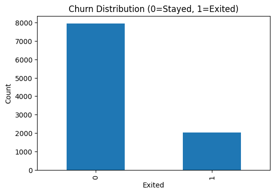
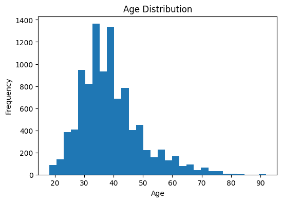
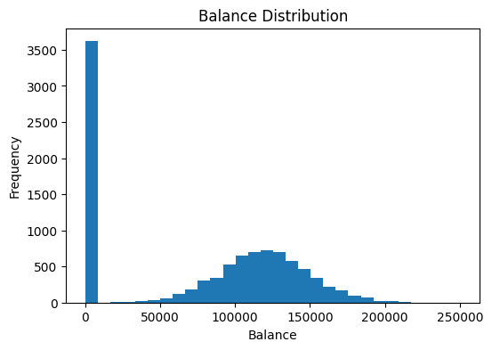
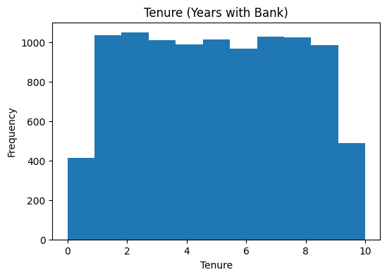

# Bank Customer Churn Prediction

End-to-end machine learning project to predict **which bank customers are likely to churn (leave)** using Python and Jupyter/Colab.

## Project Overview
This project takes a real bank churn dataset from **raw → cleaned → explored → modeled → tuned → evaluated**.  
The goal is to identify at-risk customers and compare multiple ML models, with a strong focus on **recall** (catching churners early) and handling **class imbalance** using SMOTE.

## What This Shows (Skills)
- Data cleaning & preprocessing (dropping IDs, encoding categoricals, scaling)
- Exploratory Data Analysis (EDA) with visualizations
- Model building with multiple algorithms (Logistic Regression, Random Forest, SVM, KNN)
- Hyperparameter tuning with `GridSearchCV`
- Class imbalance handling with **SMOTE**
- Model evaluation and comparison (accuracy, precision, recall, F1, ROC-AUC)
- Clear communication of trade-offs (precision vs recall in a business context)

## Workflow
1. **Load & Explore Data** – inspect structure, churn rate, and class imbalance.  
2. **EDA** – visualize churn by geography, gender, and key behavior features.  
3. **Preprocessing** – drop non-predictive IDs, one-hot encode categoricals, scale numeric features.  
4. **Modeling & Tuning** – train Logistic Regression, Random Forest, SVM, KNN and tune with `GridSearchCV`.  
5. **Imbalance Handling** – apply **SMOTE** on the training set and re-evaluate models.  
6. **Evaluation & Insights** – compare metrics, analyze feature importance, and summarize business implications.

## Key Visuals (from the notebook)

### Churn Distribution & Class Imbalance

### Churn vs Key Features (e.g., Geography, Activity)

### Model Performance / Confusion Matrix

### Effect of SMOTE or ROC Curves

## Tech Stack
- **Python**: pandas, numpy  
- **Visualization**: matplotlib, seaborn  
- **ML**: scikit-learn (LogisticRegression, RandomForest, SVM, KNN), imbalanced-learn (SMOTE)  
- **Environment**: Jupyter / Google Colab  

This project is designed to reflect my thought process on how to tackle a real churn problem:  
**structured workflow, solid EDA, correct ML and SMOTE usage, and clear, business-aware evaluation.**
